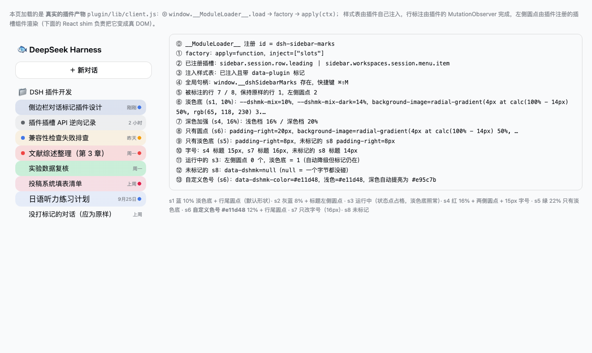
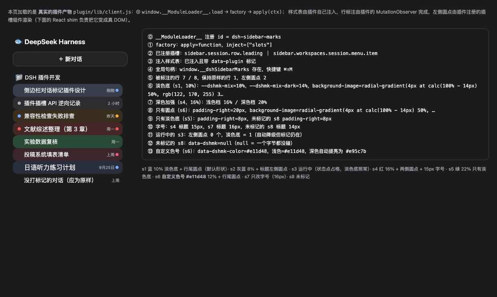
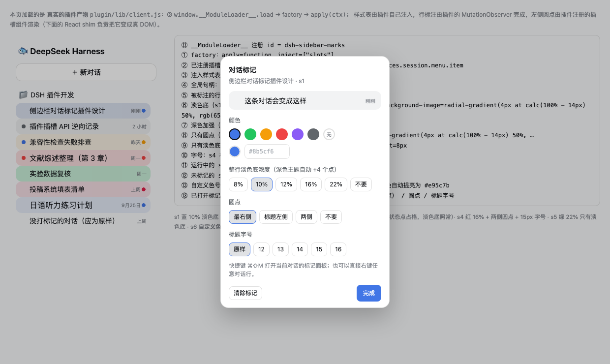

# dsh-sidebar-marks

给 DSH 左侧边栏的每个对话打标记：**整行背景的淡色底**（颜色 + 浓度自选，深色主题自动加强一档）、**最右侧或标题左侧的彩色圆点**，另可选每条对话独立的标题字号。**没打标记的对话与原生界面完全一致。**

[English](README_EN.md) · 零运行时依赖 · 自测零依赖（`node --test`）


## 安装

```sh
# 从 GitHub 装（推荐）
dsh plugin --profile web add github:QIN-SMART/dsh-sidebar-marks

# 从 npm 装（发布后）
dsh plugin --profile web add dsh-sidebar-marks
```

装完刷新一次浏览器页面即可，不需要重启 dsh web。

开发本仓库时用本地链接（路径换成你自己的克隆位置）：

```sh
git clone https://github.com/QIN-SMART/dsh-sidebar-marks
dsh plugin --profile web add "link:$PWD/dsh-sidebar-marks"
```

仓库根就是包根（`package.json` 在第一层），所以 `github:` 与 npm 两种方式装到的都是同一个包。

## 怎么用

| 入口 | 操作 |
|---|---|
| 「…」菜单 | 对话行悬停 →「…」→ **标记…**（排在「分叉会话」和「归档会话」之间） |
| 快捷键 | 侧边栏里按 **⌘⇧M**（Windows/Linux **Ctrl+Shift+M**）标记当前打开的对话 |
| 右键 | 在任意对话行上右键，直接打开该行的标记面板 |

面板里点选即时生效、即时落盘（去抖 200ms），没有保存按钮；左下角「清除标记」，`Esc` 或点面板外关闭。

## 有哪些标记

| 轴 | 可选值 | 说明 |
|---|---|---|
| 颜色 | 6 个预设：蓝（主线）/ 绿（完成）/ 琥珀（待跟进）/ 红（紧急）/ 紫（个人）/ 灰蓝（归档）；也可以**自定义**：点色盘选任意颜色，或直接填色号 `#8b5cf6`（`#abc` 也认）；还可以选「无」 | 每条对话各选各的。自定义色在深色主题下自动提亮 28%（亮度够高的颜色不折腾），和预设色一样有明暗两档 |
| 整行淡色底浓度 | 8% / 10%（默认）/ 12% / 16% / 22% / 不要 | 铺满整行（含 12px 圆角）；**深色主题自动 +4 个点**（浅色 10% ↔ 深色 14%），因为同一个数字在深色下看起来更淡 |
| 圆点 | 最右侧（画在行尾，距右边缘 14px）/ 标题左侧（原生状态点那一格）/ 两侧 / 不要 | 8px 实心圆点 |
| 标题字号 | 原样（默认）/ 12 / 13 / 14 / 15 / 16 px | 只改该对话的标题，字重可到 500/600 |
| 界面语言 | 跟随 DSH 自己的 `<html lang>`：中文 / English | 面板、菜单项、颜色名都跟着换，切换语言后立即生效 |

新标记的初始形状 = 蓝 + 10% 整行淡色底 + 最右侧圆点。

**降级**：对话正在跑（DSH 状态点占用标题左侧那格）或已归档（DSH 不渲染那格）时，「标题左侧」的圆点自动消失，整行淡色底 / 右侧圆点 / 字号照常 —— 因为那三项挂在行元素上，与插槽无关。

## 长什么样

浅色 / 深色两个主题（下图为真实产物跑在 1:1 复刻的 DSH 侧边栏结构上，会话名为示例数据）：







浅色 / 深色两套色值都写在注入的样式表里（`body[data-ds-dark-theme]` 切换），换主题不需要重绘。

## 实现要点（都是实测过的约束）

- **整行淡色底**是 `background-image: linear-gradient(var(--dshmk-fill), var(--dshmk-fill)) !important`，颜色由 `color-mix(in srgb, <标记色> <浓度>%, transparent)` 混出。DSH 的 hover / 选中态写的是 `background` **简写**（会重置 `background-image`），所以必须 `!important`；而它只改 `background-color`，于是淡色底与 hover / 选中叠加、颜色自然深一档。
- **深色加强**是 JS 在行元素上同时写 `--dshmk-mix`（浅色档）与 `--dshmk-mix-dark`（+4 个点），CSS 用 `body[data-ds-dark-theme]` 选后者 —— 切换主题立刻生效，不需要重绘。只碰被标记的行；未标记的行一个 `data-dshmk*` 属性、一个自定义属性都不会写。
- **颜色不再写死成 CSS 规则**：预设色和自定义色号走同一条路 —— JS 把「浅色值 / 深色值」写进行元素的 `--dshmk-color-light` / `--dshmk-color-dark`，CSS 只有两条规则（`[data-dshmk-color]{--dshmk-color:var(--dshmk-color-light,…)}` + 深色主题取 `--dshmk-color-dark`）。所以 `#e11d48` 这类任意色号和预设色行为完全一致，也不会因为新增颜色而膨胀样式表。
- **自定义色号的深色变体**在 JS 里算：相对亮度 > 0.55 就原样用，否则朝白色混 28%（与预设色的明暗差大致相当）。色号做了校验（`#rgb` / `#rrggbb`，自动补全并小写），非法输入不改数据、输入框回退。
- **最右侧圆点**用 `background-image: radial-gradient(circle 4px at calc(100% - 14px) 50%, …)` 画，并给该行预留 `padding-right:20px!important`：不参与布局、不干扰 React、不会被 DSH 那条 `background` 简写的 hover 规则吃掉（hover 只改 `background-color`，仍能看见）。
- **标题左侧圆点**走官方插槽 `sidebar.session.row.leading`（16×20 的格子），owner props 只有 `{ sessionId }`；`ctx.slots.inject(name, cb)` + `ctx.slots.register({name, id, order}, Component)`。
- **字号只打在标题上**：标题是行内第 2 个 `span`（第 1 个永远是 leading 插槽格），所以用 `> span:nth-child(2)`，并且只在 `:not([data-dshmk-size="inherit"])` 时才覆盖。
- **选择器只用稳定钩子**：`div[role="treeitem"][data-row-key="session:<id>"]`。仓库里那些 `YDXeBa_sessionRow` 之类的 CSS-module 哈希类名每次构建都会变，插件一个都不用。
- **样式表自己打标**（`data-plugin` / `data-plugin-css`）：client-modules 只在 factory 返回那一刻认领未打标的 `<style>`，apply 期间新建的必须自己打，否则可能被后一个 materialize 的插件认领并在它卸载时被删。
- **快捷键**用 document 级 `keydown`（`⌘/Ctrl+Shift+M`）：命中的前提是不是可编辑元素，避免在输入框里抢键；右键用 `contextmenu` + `closest('[data-row-key^="session:"]')`，只在对话行上 `preventDefault`。

## 平台支持（含 Windows）

插件只有浏览器侧代码：一张注入的样式表、行元素上的若干 `data-*` 属性、两个插槽组件和一个小面板，**不碰文件系统、不读环境变量、没有平台分支**。

| 项 | macOS | Windows | Linux |
|---|---|---|---|
| 安装命令 | `dsh plugin --profile web add …` | 同左，PowerShell 里路径加引号：`"link:C:\path\to\dsh-sidebar-marks"` | 同左 |
| 快捷键 | `⌘⇧M` | `Ctrl+Shift+M`（提示文案自动切换，处理器两个修饰键都认） | `Ctrl+Shift+M` |
| 深浅色 | `body[data-ds-dark-theme]` 两套色值都写在行元素上 | 同左 | 同左 |
| 侧边栏结构 | `[data-row-key="session:<id>"]` 与行内第 2 个 `span` | 同左（Windows 的 `[data-windows-titlebar]` 只改标题栏，不改行） | 同左 |

### Windows 上逐条核对过的结论（2026-10-02）

| 项 | 结论 |
|---|---|
| 行结构 | `[data-windows-titlebar]` 只出现在**侧边栏外壳**（root / logoRow / newSession / panelList）与右栏、布局包，`dsh-client-ui-workspace`（行的归属包）里一处都没有 —— 行结构、`data-row-key`、行内第 2 个 `span` 在 Windows 上完全一样 |
| 侧边栏宽度 | Windows 桌面版折叠后是 0 宽（不是 56px 轨道），只影响宽度，不影响行的钩子 |
| 快捷键 | DSH 全库的绑定键空间里**没有任何 `KeyM`**（保留键只有 C/V/X/Z/Y/Q/H），`Ctrl+Shift+M` 在 web:windows 上是合法且空闲的组合；Windows/macOS 桌面版会由原生 preload 先拦配置过的组合，只有用户自己把该组合绑给别的命令时才会被吞 |
| 输入法 | 面板已在 `event.isComposing` / `keyCode === 229` 时直接返回（与 DSH 自己的 `observeComposition` 守卫一致），中文输入法组字不抢键 |
| 桌面版拖拽区 | 面板与遮罩都声明了 `-webkit-app-region:no-drag`：Windows/macOS 桌面版标题栏那条是窗口拖拽区，不声明的话顶层那一条点击会被当成拖窗口（DSH 自己的浮层控件也是这么写的） |
| CSS 能力 | DSH 自己用到 `:has()` 与 `corner-shape`（Chrome 139+），说明 Electron 基线足够新，`color-mix` / `radial-gradient` 无兼容问题 |
| 安装 | `dsh plugin` 只是把参数转发给 profile 目录里的 pnpm；`link:C:\\path\\to\\pkg` 走 `node:path` 的 `isAbsolute`，在 win32 上为真；相对写法 `link:./pkg` 也会被 DSH 先解析成绝对 Windows 路径 |

CI 现在真的覆盖 Windows 分支：新增用例会用 `navigator.platform = 'Win32'` 重新加载真实产物，断言提示文案是 `Ctrl+Shift+M`、**Ctrl 路径能打开面板**、组字期间不抢键（此前测试写死 MacIntel 且只按 ⌘，Windows 分支从没被执行过）。

装到 Windows 后建议人工点这 3 项（按风险排序）：① 右键任一对话行能否弹面板；② 中文输入法开着时按 `Ctrl+Shift+M` 不误弹、且不切输入法；③ 深色主题下行尾圆点与淡色底是否正常。

CI 在 ubuntu / windows / macos × Node 22 / 24 上跑同一套自测（`.github/workflows/verify.yml`）。

## 验证

```sh
cd plugin && node --test test/verify.mjs      # 21 个用例，全绿
```

用 `vm` 执行**真实的** `lib/client.js`（走真实的 `window.__ModuleLoader__.load` 路径 + 最小 DOM 桩），覆盖模块形状、插槽注册、样式表打标、行标注幂等与回收、未标记行零改动、archived/运行中降级、快捷键与右键、面板开关、序列化往返、坏数据与旧版字段丢弃、多标签页 storage 同步、dispose 清理、「CSS 里不许出现打包哈希类名」，以及自定义颜色的色号校验 / 归一化 / 深色变体 / 写进行元素 / 色盘拖动时面板不重建。

浏览器侧：

- `demo/plugin-harness.html?theme=light|dark&panel=1` —— 加载真实产物，页面上打印 12 项断言（含 `::after` 尺寸、`radial-gradient` 底色、预留内边距、生效字号）。
- `tools/real-ui-check.mjs <token>` —— 用 CDP 驱动无头 Chrome 打开真实 GUI：给前 6 条对话打上不同标记、截三张图（侧边栏 / 行菜单 / 标记面板），并断言菜单里出现「编辑标记…」、面板能打开。

运行时自检（DevTools 控制台）：

```js
window.__dshSidebarMarks.marks                       // 当前所有标记
window.__dshSidebarMarks.set('<sessionId>', { color:'#e11d48', fill:16, dots:'both', size:'l' })
window.__dshSidebarMarks.open('<sessionId>')         // 打开某条对话的面板
window.__dshSidebarMarks.current()                   // 当前打开的对话 id
window.__dshSidebarMarks.rescan()                    // 手动重扫（正常由 MutationObserver 自动完成）
```

## 数据放在哪

`localStorage['dsh.sidebar-marks.v1']`：

```json
{ "version": 2, "marks": { "<sessionId>": { "color": "blue", "fill": 10, "dots": "right", "size": "inherit" } } }
```

官方同类插件（`ui-sidebar-right` 的 `dsh.sidebar-right.v1.<sessionId>`、`ui-conversation` 的 `dsh.conversation.<sessionId>`）就是这个做法，多标签页用 `storage` 事件同步。

**边界**：localStorage 绑定 origin —— 换端口（`--port 0`）、改用 `localhost:3080`、换浏览器 / 隐身窗口 / 清站点数据都会丢。要跨浏览器持久：给 `index.mjs` 里那条 Loader entry 加一个 `.volatile()` 的 JSON 字符串 `Config`，客户端改读 `ctx.configForms.get('sidebar-marks')`；`lib/client.js` 的读写已经收敛在 `loadMarks` / `saveMarks` 两个函数里。

## 在「设置 → 插件」里显示成什么样

插件列表那一行的图标、标题、描述来自 **package.json + 包内 `locale/*.json`**（DSH 的 `readPluginMeta` 每次读取清单时解析，不会执行插件代码）：

| 字段 | 作用 |
|---|---|
| `icon` | 相对路径的 SVG/PNG/JPEG/WebP，≤256 KiB，必须留在包目录内；会被读成 data URL 显示 |
| `locale/en.json`、`locale/zh.json` | 各自的 `{"meta":{"title":"…","description":"…"}}`；**en 是锚点**，同目录下所有 `.json` 按文件名当语言 id 读入 |
| `exports["./locale/*.json"]` | 这两个文件必须通过 exports 暴露，否则解析器拿不到 |
| `description` | 兜底文案（没有 locale 时用它） |

**注意**：如果该包在宿主进程启动时就已经解析过，Node 的 ESM 解析器会缓存那份 package.json（含 exports 表）；此后新增的 `./locale/*.json` 出口要**重启一次 dsh web** 才生效。症状很好认 —— 图标已经是新的，标题却还是包名、描述还是英文兜底。

验证元数据解析（用 DSH 自己的读取器，不必起浏览器）：

```js
// 在你本机的 DSH 安装目录里（`npm root -g`/nvm 的 node_modules 下）：
import { readPluginMeta } from '@deepseek-ai/dsh-app-boot'
// parentURL 指向你当前 profile 的 package.json
readPluginMeta('dsh-sidebar-marks', new URL('file:///path/to/.dsh/profiles/web/package.json').href)
// → { title: { en: '…', zh: '侧边栏对话标记 (dsh-sidebar-marks)' }, description: {…}, icon: 'data:image/svg+xml;base64,…' }
```

## 文件

```
package.json        dsh.bundle.patch + dsh.client.platform=web；不写 @deepseek-ai/* peer（兼容性检查直接通过）
cordis.patch.yml    让本包成为一条 enabled 的 Loader 行（id: sidebar-marks，客户端常量必须与它一致）
index.mjs           host 半，故意惰性
lib/client.js       全部行为：样式表 / 标记存储 / 行标注 / 两个插槽组件 / 标记面板 / 快捷键与右键 / 中英文案
icon.svg            插件列表里的图标
locale/zh.json      插件列表里的中文名与描述（en.json 是解析锚点）
test/verify.mjs     22 个用例，零依赖
demo/               交互试用台 + 真实产物端到端验证页
docs/               截图（示例数据）
tools/real-ui-check.mjs  CDP 脚本：无头驱动真实 GUI 打标记并截图
README.md README_EN.md LICENSE CHANGELOG.md .github/workflows/verify.yml
```

## 让别人能发现它（准备清单）

- 仓库**描述**里带上关键词：`DeepSeek Harness plugin: sidebar conversation marks …`
- Topics 建议：`deepseek-harness`、`dsh`、`dsh-plugin`、`sidebar`、`conversation`
- 原因：内置的插件市场（`@hydrogenoxide18/dsh-plugin-market`）走的是 **GitHub 仓库搜索**，默认查询 `deepseek harness plugin`、按 star 排序、每页 30 条，且**不按 topic 过滤** —— 默认列表里新仓库会排在很后面，能不能被发现主要靠描述/名称/话题命中关键词，以及用户自己搜。
- 推送后别人一条命令：`dsh plugin --profile web add github:QIN-SMART/dsh-sidebar-marks`

### 发布（维护者用）

```sh
# 1) 推到 GitHub（用 REST API，绕开时通时断的 github.com）
GH_TOKEN=<PAT，需 repo + workflow scope> npm run publish:github -- --release
#    --release 会顺带打 v<package.json 的 version> tag，并用 CHANGELOG 对应段落建 Release
#    加 --dry-run 只列文件、不写任何东西

# 2) 发到 npm（需要先 npm login 一次）
npm publish
```

`workflow` scope 是必须的（仓库含 `.github/workflows/verify.yml`）；npm 那边如果开了 2FA，用 `npm publish --otp=<六位码>`。

### 若 `github.com` 连不上（只 `api.github.com` 通）

`gh auth login` 的设备码/浏览器流程走的是 `github.com/login/*`，在某些网络下会超时；而 `api.github.com` 通常稳定。此时用仓库里的 `tools/publish-to-github.mjs`，它只用 REST API 建仓库、传文件、建提交、设 topics：

```sh
GH_TOKEN=<PAT，需 repo + workflow scope> node tools/publish-to-github.mjs
node tools/publish-to-github.mjs --dry-run     # 只看会发什么，不写任何东西
```

（`workflow` scope 是必须的：仓库里有 `.github/workflows/verify.yml`。发布完建议撤销该 token。）

## 卸载

```sh
dsh plugin --profile web remove dsh-sidebar-marks
```

`apply()` 里 `ctx.effect` 注册的清理会断开 MutationObserver、清掉定时器、摘掉样式表、卸载快捷键与右键监听、关掉面板、删除调试全局。localStorage 里的标记不会被自动删除。
